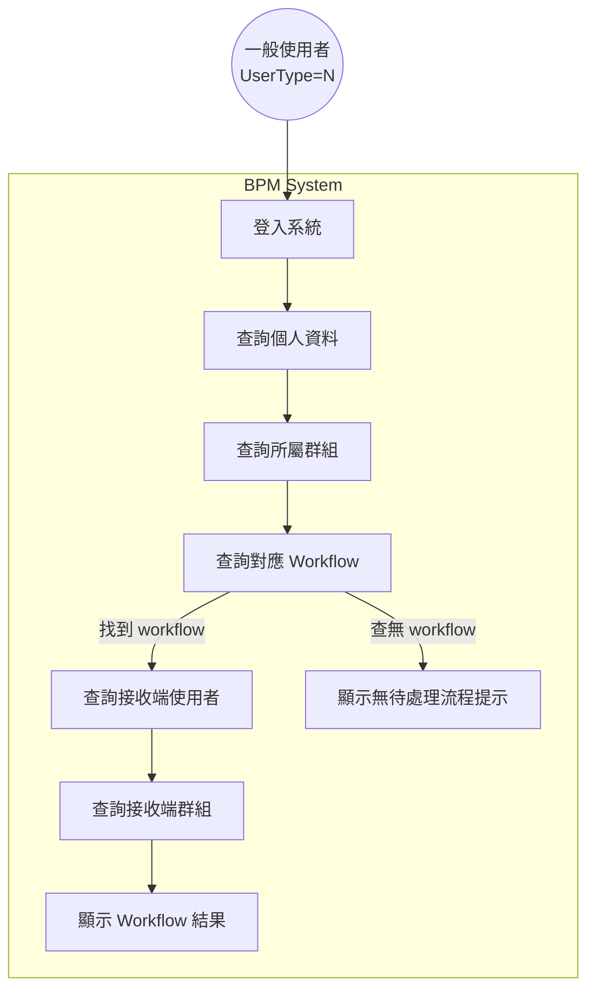
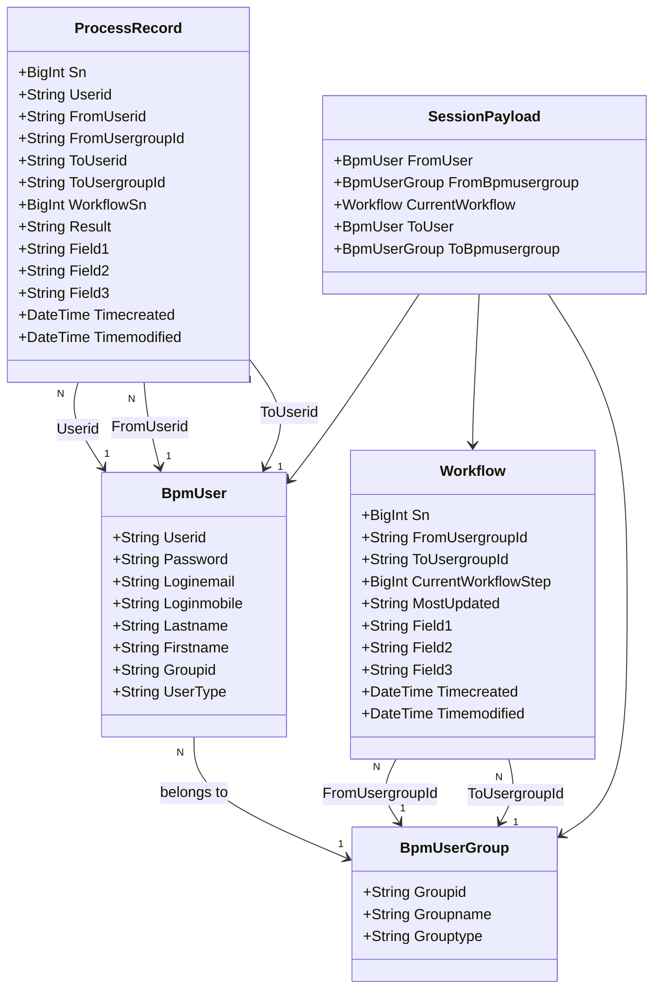
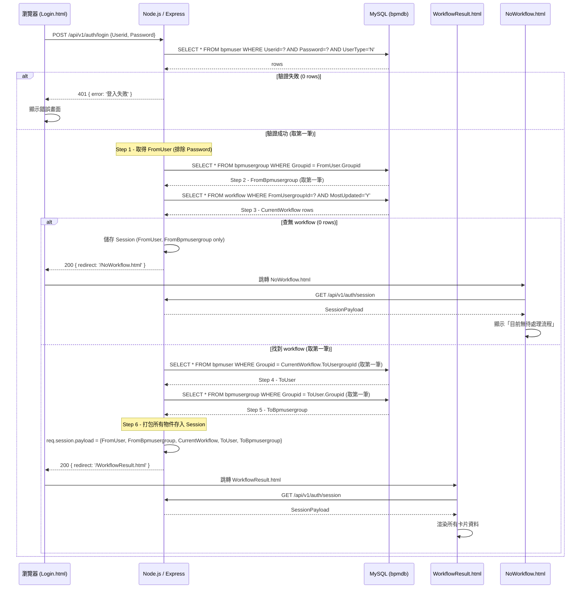

# BPM 系統分析與設計文件

## 1. Use Case Diagram

```mermaid
graph TD
    subgraph BPM System
        UC1[登入系統]
        UC2[查詢個人資料]
        UC3[查詢所屬群組]
        UC4[查詢對應 Workflow]
        UC5[查詢接收端使用者]
        UC6[查詢接收端群組]
        UC7[顯示 Workflow 結果]
        UC8[顯示無待處理流程提示]
    end

    User((一般使用者\nUserType=N))

    User --> UC1
    UC1 --> UC2
    UC2 --> UC3
    UC3 --> UC4
    UC4 -->|找到 workflow| UC5
    UC5 --> UC6
    UC6 --> UC7
    UC4 -->|查無 workflow| UC8
```

## 2. Class Diagram

```mermaid
classDiagram
    class BpmUser {
        +String Userid
        +String Password
        +String Loginemail
        +String Loginmobile
        +String Lastname
        +String Firstname
        +String Groupid
        +String UserType
    }

    class BpmUserGroup {
        +String Groupid
        +String Groupname
        +String Grouptype
    }

    class Workflow {
        +BigInt Sn
        +String FromUsergroupId
        +String ToUsergroupId
        +BigInt CurrentWorkflowStep
        +String MostUpdated
        +String Field1
        +String Field2
        +String Field3
        +DateTime Timecreated
        +DateTime Timemodified
    }

    class ProcessRecord {
        +BigInt Sn
        +String Userid
        +String FromUserid
        +String FromUsergroupId
        +String ToUserid
        +String ToUsergroupId
        +BigInt WorkflowSn
        +String Result
        +String Field1
        +String Field2
        +String Field3
        +DateTime Timecreated
        +DateTime Timemodified
    }

    class SessionPayload {
        +BpmUser FromUser
        +BpmUserGroup FromBpmusergroup
        +Workflow CurrentWorkflow
        +BpmUser ToUser
        +BpmUserGroup ToBpmusergroup
    }

    BpmUser "N" --> "1" BpmUserGroup : belongs to
    Workflow "N" --> "1" BpmUserGroup : FromUsergroupId
    Workflow "N" --> "1" BpmUserGroup : ToUsergroupId
    ProcessRecord "N" --> "1" BpmUser : Userid
    ProcessRecord "N" --> "1" BpmUser : FromUserid
    ProcessRecord "N" --> "1" BpmUser : ToUserid
    SessionPayload --> BpmUser
    SessionPayload --> BpmUserGroup
    SessionPayload --> Workflow
```

## 3. Sequence Diagram

```mermaid
sequenceDiagram
    participant Browser as 瀏覽器 (Login.html)
    participant Express as Node.js / Express
    participant DB as MySQL (bpmdb)
    participant WF as WorkflowResult.html
    participant NW as NoWorkflow.html

    Browser->>Express: POST /api/v1/auth/login {Userid, Password}
    Express->>DB: SELECT * FROM bpmuser WHERE Userid=? AND Password=? AND UserType='N'
    DB-->>Express: rows

    alt 驗證失敗 (0 rows)
        Express-->>Browser: 401 { error: '登入失敗' }
        Browser->>Browser: 顯示錯誤畫面
    else 驗證成功 (取第一筆)
        Note over Express: Step 1 - 取得 FromUser (排除 Password)

        Express->>DB: SELECT * FROM bpmusergroup WHERE Groupid = FromUser.Groupid
        DB-->>Express: Step 2 - FromBpmusergroup (取第一筆)

        Express->>DB: SELECT * FROM workflow WHERE FromUsergroupId=? AND MostUpdated='Y'
        DB-->>Express: Step 3 - CurrentWorkflow rows

        alt 查無 workflow (0 rows)
            Express->>Express: 儲存 Session (FromUser, FromBpmusergroup only)
            Express-->>Browser: 200 { redirect: '/NoWorkflow.html' }
            Browser->>NW: 跳轉 NoWorkflow.html
            NW->>Express: GET /api/v1/auth/session
            Express-->>NW: SessionPayload
            NW->>NW: 顯示「目前無待處理流程」
        else 找到 workflow (取第一筆)
            Express->>DB: SELECT * FROM bpmuser WHERE Groupid = CurrentWorkflow.ToUsergroupId (取第一筆)
            DB-->>Express: Step 4 - ToUser

            Express->>DB: SELECT * FROM bpmusergroup WHERE Groupid = ToUser.Groupid (取第一筆)
            DB-->>Express: Step 5 - ToBpmusergroup

            Note over Express: Step 6 - 打包所有物件存入 Session
            Express->>Express: req.session.payload = {FromUser, FromBpmusergroup, CurrentWorkflow, ToUser, ToBpmusergroup}

            Express-->>Browser: 200 { redirect: '/WorkflowResult.html' }
            Browser->>WF: 跳轉 WorkflowResult.html
            WF->>Express: GET /api/v1/auth/session
            Express-->>WF: SessionPayload
            WF->>WF: 渲染所有卡片資料
        end
    end
```
